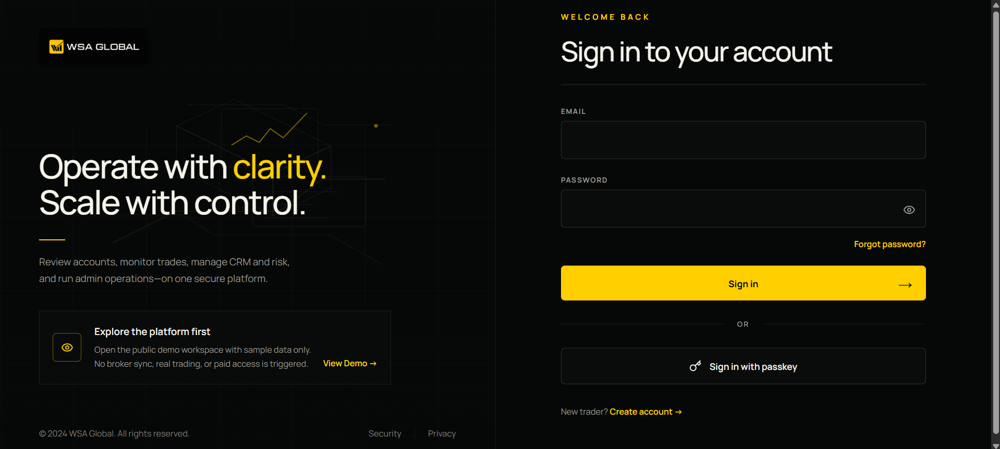
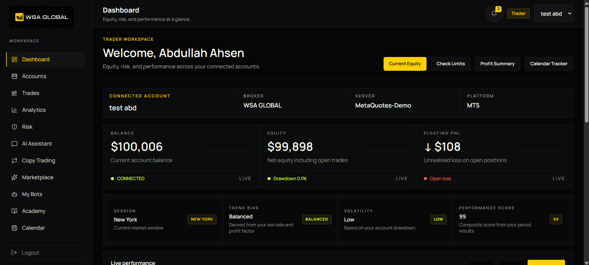
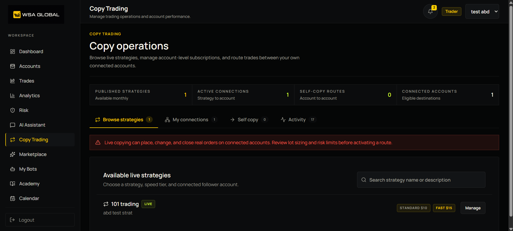
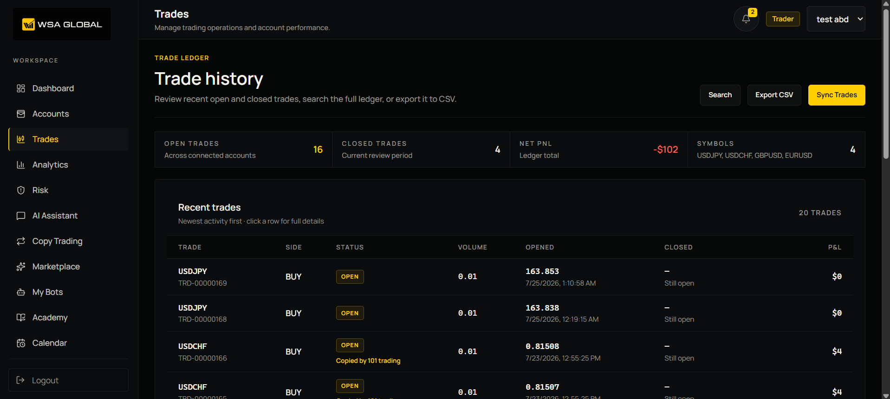
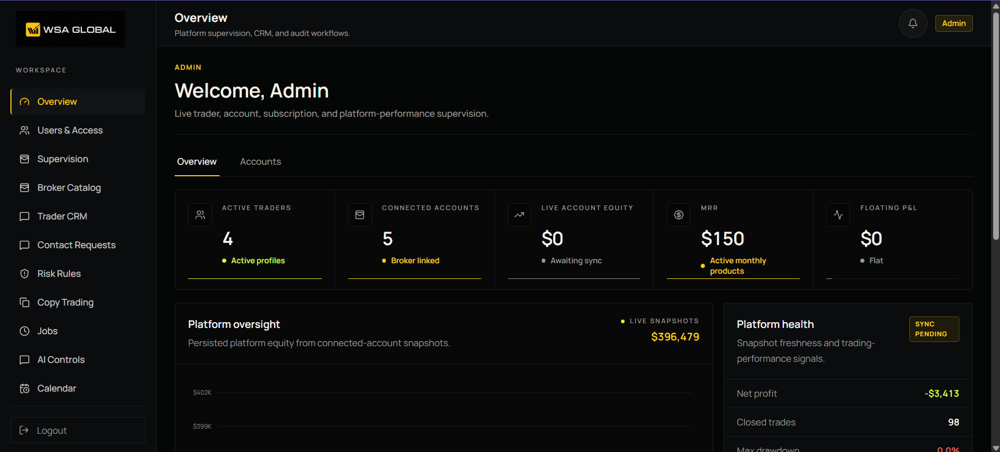

# WSA Global Trading Platform

[](https://nextjs.org/)
[](https://react.dev/)
[](https://www.typescriptlang.org/)
[](https://supabase.com/)
[](https://www.metatrader5.com/)
[](https://stripe.com/)
[](https://wsa-global-trading-platform.vercel.app/)
[](https://wsa-global-trading-platform.vercel.app/demo)

WSA Global is a multi-role trading operations platform for connected MT4/MT5 accounts, live portfolio monitoring, controlled copy trading, risk enforcement, billing, education, evaluations, and partner management.

**[Open the live platform](https://wsa-global-trading-platform.vercel.app/)** · **[Explore the public demo](https://wsa-global-trading-platform.vercel.app/demo)** · **[Read the deployment notes](docs/deployment.md)**



## What the platform does

### MT4 and MT5 account connections

Traders and administrators can connect MetaTrader accounts through the platform using the MetaApi integration.

- Secure, server-side credential handling
- MT4 and MT5 account provisioning and connection-status checks
- Broker-server discovery and manual server entry
- Balance, equity, floating P&L, drawdown, positions, and trade-history synchronization
- Manual sync plus background synchronization jobs
- Connected-account scoping so each trader only sees their own live accounts
- Automatic inactive-account handling and reconnection workflows



### WSA live copy-trading engine

The WSA engine supports administrator-published strategies and trader-managed account routes without exposing broker credentials to the browser.

- Admin-owned master accounts and published monthly strategies
- Standard and premium/fast strategy tiers
- Per-follower account subscriptions
- Trader self-copy routes between their own connected accounts
- OPEN, MODIFY, and CLOSE propagation
- Fixed-lot, multiplier, balance-proportional, and equity-proportional sizing
- Global, strategy, and per-account stoppage rules
- Maximum lot, drawdown, daily loss, symbol, and open-position controls
- Idempotent execution links and detailed copy execution logs
- Dedicated continuous worker for MetaApi streams and order routing

Live execution is intentionally gated. A new deployment keeps `BROKER_EXECUTION_ENABLED=false` until MetaApi, workers, entitlements, consent, and risk controls have been verified with demo accounts.



### Trade monitoring and analytics

- Open and closed trade ledger with search and CSV export
- Copy-strategy attribution on copied trades
- Account-level and all-account analytics
- Equity, P&L, win rate, profit factor, drawdown, and daily calendar views
- Live snapshots and automatic trade updates from connected accounts
- Responsive dashboards for desktop and mobile devices



### Administration

The admin console provides a single operational view across users, trading accounts, risk, billing, copy trading, and platform services.

- User access, roles, suspension, and partner assignment
- Account supervision and broker catalog management
- Live risk rules, events, restrictions, and monitoring
- Master accounts, strategies, followers, copy logs, and stoppage controls
- Stripe orders, subscriptions, access entitlements, and webhook processing
- Partner commissions, rebates, ledgers, and withdrawals
- Background job queue, retries, cancellation, and worker controls
- AI provider keys, limits, and usage controls
- Academy content, webinars, evaluations, certificates, and verification
- Bot marketplace products, protected releases, licenses, and downloads
- Audit logs, contact requests, calendar publishing, and terminal controls



### Trader and partner workspaces

| Workspace | Capabilities |
|---|---|
| Trader | Accounts, trades, analytics, risk, WSA Assistant, copy trading, marketplace, bots, academy, calendar, evaluations, billing, reports, and settings |
| Partner | Referred traders, CRM notes, activity, commissions, rebates, payout ledger, exports, and withdrawal requests |
| Admin / Super Admin | Platform supervision, access control, broker and copy operations, billing, partner finance, risk, jobs, content, AI, and audit |

## Architecture

```text
MT4 / MT5 accounts
        │
        ▼
MetaApi connection and trade streams
        │
        ├──► Account and trade synchronization ──► Supabase ──► Trader/Admin UI
        │
        ├──► Live risk worker ──► events, restrictions, notifications
        │
        └──► WSA copy worker ──► sizing + risk gates ──► follower accounts

Stripe Checkout ──► signed webhook ──► orders and access entitlements
```

The Next.js application is stateless and can run on Vercel. Continuous copy monitoring, live risk enforcement, and queued broker synchronization should run on a persistent Node.js worker host.

## Technology

| Layer | Technology |
|---|---|
| Web application | Next.js 16 App Router, React 19, TypeScript |
| Styling and UI | Tailwind CSS 4, Radix UI, Framer Motion, Lucide |
| Database and authentication | Supabase PostgreSQL, Supabase Auth, RLS |
| Broker integration | MetaApi Cloud SDK for MT4/MT5 |
| Payments | Stripe Checkout, subscriptions, and signed webhooks |
| Data and state | TanStack Query, Supabase Realtime, Zustand |
| Charts | Recharts, Lightweight Charts, TradingView embed |
| Testing | Vitest and Playwright |
| Deployment | Vercel web app plus persistent Node workers |

## Local setup

### Requirements

- Node.js 20 or newer
- npm
- A Supabase project
- A MetaApi token for MT4/MT5 connections
- Stripe test-mode credentials when testing payments

### Install and run

```powershell
git clone https://github.com/abdullahahsen05/wsa-global-trading.git
cd wsa-global-trading
npm install
Copy-Item .env.example .env.local
npm run migrate
npm run dev
```

Open [http://localhost:3000](http://localhost:3000). The public sample workspace is available at [http://localhost:3000/demo](http://localhost:3000/demo).

Do not commit `.env.local`. Keep all Supabase service keys, MetaApi tokens, Stripe secrets, encryption keys, worker secrets, and broker credentials server-side.

### Essential configuration

| Capability | Environment variables |
|---|---|
| Supabase | `NEXT_PUBLIC_SUPABASE_URL`, `NEXT_PUBLIC_SUPABASE_ANON_KEY`, `SUPABASE_SERVICE_ROLE_KEY`, `SUPABASE_DB_PASSWORD` |
| Application URLs | `NEXT_PUBLIC_SITE_URL`, `NEXT_PUBLIC_APP_URL` |
| MT4/MT5 | `METAAPI_TOKEN`, `METAAPI_RELIABILITY`, `BROKER_PROVIDER` |
| Live broker execution | `BROKER_EXECUTION_ENABLED` |
| Background workers | `WORKER_SECRET`, `WORKER_MAX_JOBS_PER_RUN`, `WORKER_STALE_JOB_MINUTES` |
| Credential encryption | `ENCRYPTION_KEY` |
| Stripe | `BILLING_PROVIDER`, `STRIPE_SECRET_KEY`, `STRIPE_WEBHOOK_SECRET`, product price IDs |
| AI assistant | Database-managed provider key or environment fallback, plus AI usage limits |

Review [`.env.example`](.env.example) for the complete list and safe defaults.

## Workers

The web application and worker processes have separate responsibilities:

```powershell
# General queued account and platform jobs
npm run jobs:worker

# Continuous master-strategy and self-copy streams
npm run copy:worker

# Continuous account risk monitoring
npm run risk:worker
```

Only run live workers after confirming the environment, demo-account connections, risk rules, and execution flag. Worker payloads use internal IDs rather than raw broker credentials.

## Useful commands

```powershell
npm run dev
npm run build
npm run start
npm run lint
npm run test
npm run test:e2e
npx tsc --noEmit
npm run migrate
```

## Security and execution safeguards

- Supabase Row Level Security and server-side role checks protect role-scoped data.
- Broker credentials and provider keys are never returned to the browser after storage.
- Stripe webhooks require signature verification before access is activated.
- Live copy execution requires explicit configuration, entitlement, consent, healthy connected accounts, and passing risk checks.
- Duplicate master events and follower executions are deduplicated.
- Closing an existing copied position is treated separately from opening a new position, so an opening limit does not prevent the master close from being propagated.
- Admin and worker actions are recorded in audit or execution logs.

Trading and copy trading involve financial risk. Test broker execution with demo accounts before enabling it for any live account.

## Project documentation

- [Background worker architecture](docs/BACKGROUND_WORKER.md)
- [Database model](docs/database-model.md)
- [Deployment notes](docs/deployment.md)
- [Implementation status](docs/IMPLEMENTATION_STATUS.md)
- [Requirements summary](docs/requirements-summary.md)

## Production

- Web: [wsa-global-trading-platform.vercel.app](https://wsa-global-trading-platform.vercel.app/)
- Public demo: [wsa-global-trading-platform.vercel.app/demo](https://wsa-global-trading-platform.vercel.app/demo)

---

Built for WSA Global.
